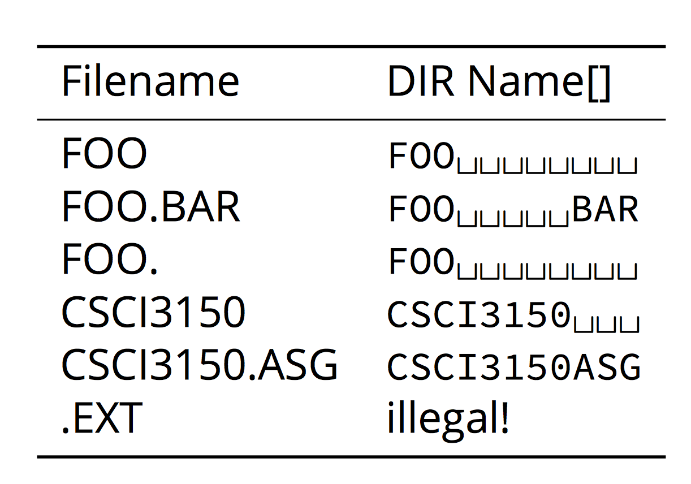

# 8+3 File Name {#83-file-name}

It is a standard of a filename used by FAT system.

Filenames are limited to **at most** 8 characters, followed by file extension of a period '.' and **at most** 3 characters.

In the Dir Entry header, it is defined as:

```c
#define MSDOS_NAME      11      /* maximum name length */
__u8    name[MSDOS_NAME];/* name and extension */
```

That's mean the size of the filename array is 11. Here are some examples of 8+3 filenames that stored inside the array.



## File Deletion and File name {#file-deletion-and-file-name}

In FAT32, deleting a file does not mean to **remove** from the filesystem. It only deallocates the space that the file originally occupied and deletion is marked. In this case, the first character of the filename is marked with a special`0xe5`.

