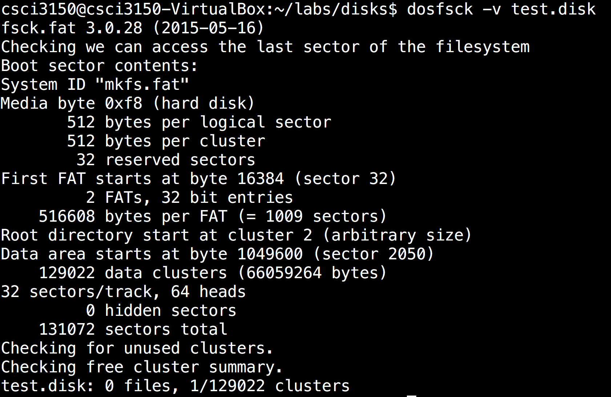

# Check and Repair FAT filesystem {#check-and-repair-fat-filesystem}


In Linux, we have a tool to check the details of the FAT filesystem. The command is`dosfcsk`.

By this command, we can verify the disk we initialized earlier.

To verify,

```
$ dosfsck -v test.disk

```

Then the following will appear:

This agrees with the settings of`mkfs.vfat`that we ran.

