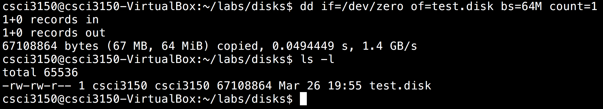

# Disk Duplication`dd` {#disk-duplication-dd}

`dd`is a command for low-level copying. As the disks on Unix platform are represented like normal files, so`dd`can take input from/output to these devices. We also can use`dd`to create a 'virtual' disk.

To begin with, let 's try the following command:

```
sudo dd if=FILE of=FILE bs=BYTES count=BLOCKS

```

`dd`takes few arguments:

* `if`
  : Input file FILE \(eg: /dev/zero,/dev/urandom\)
* `of`
  : Output file FILE
* `bs`
  : Block size: read and write BYTES bytes at a time.
* `count`
  : copy only BLOCKS input blocks.

## Example {#example}

Now we wish to create a file with zeros about 64MB

```
$ dd if=/dev/zero of=test.disk bs=64M count=1
```

After that, you can see the result showing:



