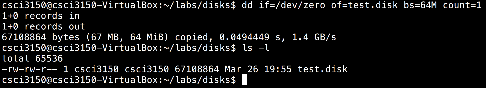

# Demo {#demo}

Now we can try the whole demo example with the following commands:

1. Create a new file `test.disk` to hold the virtual drive volume by pre-filling the file with data:
```
~$ dd if=/dev/zero of=test.disk bs=64M count=1
```

2. Next up we give the volume a filesystem. Here, we format it with FAT32:
```
~$ mkfs.vfat -F 32 -f 2 -S 512 -s 1 -R 32 test.disk
```

3. Check the details of the FAT filesystem:
```
~$ dosfsck -v test.disk
```

4. Mount: to mount the formatted file `test.disk` from the terminal, you will need to first create a folder to mount it to. Let’s say we want to mount it to the folder `~/rd`. 

** Here is the procedure:

* First create the folder there. 
```
~$ mkdir ~/rd
```
* Then mount the file `test.disk` to the folder `~/rd`: 
```
~$ sudo mount -t vfat -o loop test.disk ~/rd
```
* Now we can create/copy files to the drive:
```
~$ cd ~/rd
~/rd$ ls
~/rd$ sudo touch a
~/rd$ ls
```
* When we finished, `unmount` the volume by running this command:
```
~/rd$ cd -
$ sudo umount ~/rd
```

Here are the results of the demo:



