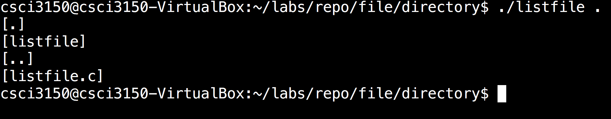

# Directory Related Calls in C Language {#directory-related-calls}

Here are the summary of the system calls to manipulate the directories.

| Function | Description | Returns |
| :--- | :--- | :--- |
| mkdir\(const char \* pathname, mode\) | Create a dirctory | 0 if OK, -1 on error |
| rmdir\(const char \* pathname\) | Delete a directory | 0 if OK, -1 on error |
| opendir\(const char \* pathname\) | Open a directory | Pointer of `DIR` if OK, NULL on error |
| readdir\(DIR \* dp\) | Read a directory | Pointer of `dirent` if OK, `NULL` at the end of directory or error |
| closedir\(DIR \* dp\) | Close a directory | 0 if OK, -1 on error |

In \*nix, we have a special data structure for a directory, namely`DIR`and`dirent`.

`DIR`is a structure for directory streams, and`dirent`has the following members:

* `ino_t d_ino`
  : file serial number
* `char d_name[]`
  : Name of entry.

## Example {#example}

In the following, we try to make use of`opendir`and`readdir`to traverse the directory, simulating a simple`ls`.

```c
/* listdir.c */
#include <stdio.h>
#include <dirent.h>

int main (int argc,char *argv[]) {
    int total = 0;
        DIR *pDir;
        struct dirent *pDirent;

        if (argc < 2) {
            printf ("Missing out directory!\n");
            return -1;
        }
        pDir = opendir (argv[1]);
        if (pDir == NULL) {
            printf ("Cannot open directory '%s'\n", argv[1]);
            return 1;
        }

        while ((pDirent = readdir(pDir)) != NULL) {
            printf ("[%s]\n", pDirent->d_name);
        }
        closedir (pDir);
        return 0;
    }

```

When you run the command \`./listdir .',



The content of the current directory is printed.

