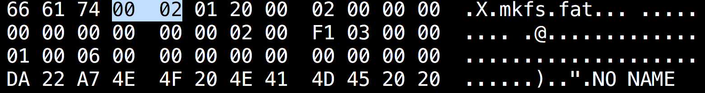

# Endian-ness in FAT32 {#endianness-in-fat32}

Endian-ness is about byte ordering. We have two types:**Big endian**and**little endian**

Suppose we see the following, which represents the bytes per sector.

We have two ways to interpret this number, either_0x00 02_or_0x02 00_

## Big Endian {#big-endian}

0x0002 = 2 bytes

## Little Endian {#little-endian}

0x0200 = 512 bytes

As in FAT32,**Little Endian** is used. Therefore, the number of bytes per sector is_512 bytes_.

