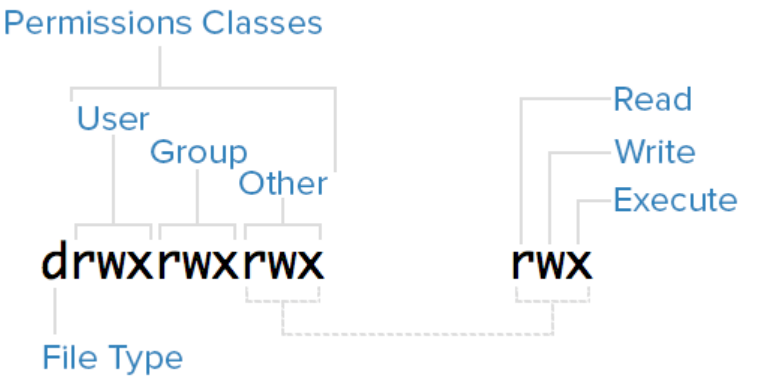

# File Permission {#file-permission}

## Linux Permissions Basics {#linux-permissions-basics}

Each file in Linux is owned by a single user and a single group, and has its own access permissions. The most common way to view the permissions of a file is`ls -l myfile`.

The meaning of each column is shown as follows.

The first column is file mode. Files mode contains information of file type and permissions. The owner of a file belongs to user category. The members of the file's group belong to group category while other users that are not part of the user or group categories belong to other category. Every category has three permissions: read, write, execute that are indicated by`R`,`W`,`X`respectively. A hyphen \(-\) in the place of one of these characters indicates that the respective permission is not available for the respective category. We can see that execute permission of file "myfile" do not available for all three categories.

Permissions can also be represented with octal notation. Each permissions category \(owner, group owner, other\) is represented by a number between 0 and 7. We let read permissions equals to 4 while write and execute permission equal to 2 and 1 respectively. Add up the numbers associated with the type of permissions we would like to grant for each category. This will be a number between 0 and 7 \(0 representing no permissions and 7 representing full read, write, and execute permissions\) for each category. For example "777" means that all there permissions categories have read, write and execute permissions.

### Modifying Permissions -- chmod {#modifying-permissions--chmod}

Change a file's permissions, we can use chmod command with octal notation. For example, we want to execute "myfile" as the owner and we don't want anyone else to modify the file, including group owners. Then we can command

```
chmod 744 myfile

```


As you can see, the permissions were assigned correctly.

### Setting Default Permissions -- umask {#setting-default-permissions--umask}

`umask`defines the default permissions for newly created files based on the "base" permissions set defined for files and directories. Usually the base permissions set is 777, that is files or directories can be read, write, and execute permissions for all users. Base permissions subtract "mask", then we get the default permissions for newly created files.

For example, we use touch to creat a new file "test", we see the default permissions of "test" is 664. If we want to change the default permission to be 666, then we can use umask to set "mask" to be 777-666=111, as shown in the below picture.

