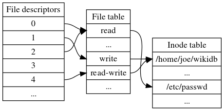

# Linux File System Calls {#linux-file-system-calls}

To the kernel, all open files are referred to by **File descriptors**. A file descriptor is a non-negative number. When we open an existing file or create a new file, the kernel returns a file descriptor to the process. When we want to read or write a file, we identify the file with the file descriptor.

Each Linux process \(except perhaps a daemon\) should expect to have **three** standard POSIX file descriptors:

| POSIX Constants Name | File Descriptors | Description |
| :--- | :--- | :--- |
| STDIN\_FILENO | 0 | Standard input |
| STDOUT\_FILENO | 1 | Standard output |
| STDERR\_FILENO | 2 | Standard error |

There are three "system file tables": 

* There is a **file descriptor table** that maps file descriptors \(small integers\) to entries in the **open file table**.
* Each entry in the **open file table** contains \(among other things\) a file offset and a pointer to the in-memory **inode table**. 
* In **open file table**, one file table entry has an `open()` call, and it is shared if the file descriptor is `dup()ed` or `fork()ed`.

Figure: file descriptors for a single process, file table and inode table. 

Note that 

* multiple **file descriptors** can refer to the same **file table** entry \(e.g., as a result of the dup system call\);
* multiple **file table** entries can in turn refer to the same **inode** \(if it has been opened multiple times; the table is still simplified because it represents inodes by file names, even though an inode can have multiple names\). 
* File descriptor 3 does not refer to anything in the file table, signifying that it has been **closed**.

