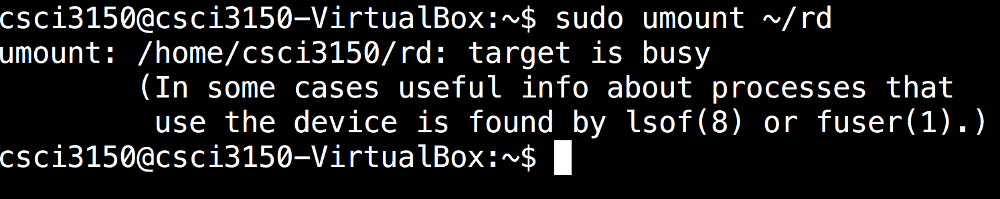
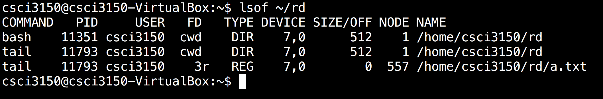
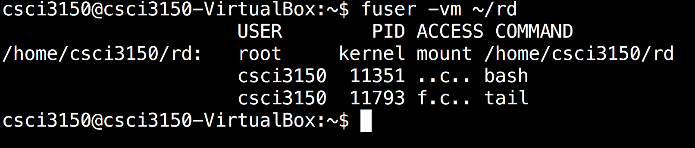

# Mount {#mount}

The `mount` command mounts a storage device or file system, making it accessible and attaching it to an existing directory structure. This attached directory is called a **mount point**. In this way, users can access a storage device or filesystem just like a normal directory.

Remember to **unmount** after using, otherwise the file system is not fully synchonized, which will cause loss of data.

## Steps {#steps}

1. First, create a **mount point**:

   ```
   $ mkdir ~/rd

   ```

2. Then, we mount the disk to the **mount point**:

   ```
   $ sudo mount -t vfat -o loop test.disk ~/rd

   ```

3. After that, we can unmount the disk by:

   ```
   $ sudo umount ~/rd

   ```


## How to solve device busy problem {#how-to-solve-device-busy-problem} (Study by yourself)

There is the case where a process continously occupies the device such that you cannot unmount it.

In this case,we can make use of either one of the two commands to locate the process.

### Method 1: lsof {#method-1-lsof}

```
$ lsof ~/rd

```



### Method 2: fuser {#method-2-fuser}

```
$ fuser -vm ~/rd

```



By these two commands, you can know `tail` with PID 11793 is occupying the resource. By killing it using`kill -9`, you can umount the resource successfully.

