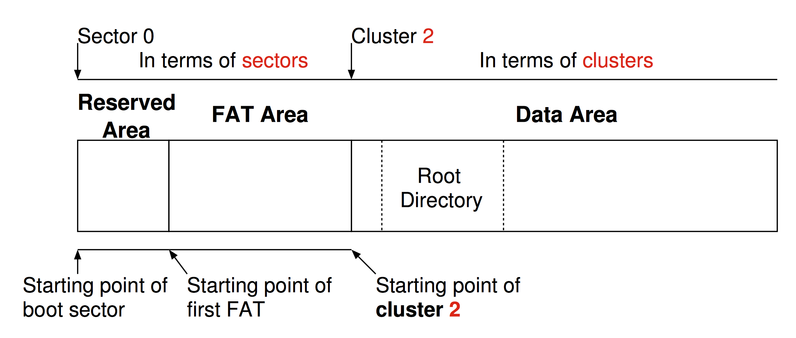

# Overview of FAT32 {#overview-of-fat32}

## Overview {#overview}

This figure summarized the FAT32 filesystem.

The first area contains the _reserved area_ and _FAT area_. They are counted in term of **sectors**.

Immediately after _FAT area_, it is the starting point of **cluster 2**. It contains the information on the root directory and all data stored. In these areas they are counted in term of **clusters**.

## Boot sector {#boot-sector}

It is always at the **first** sector of the disk, and it is used for starting up your computer. It contains:

* An x86-based CPU jump instruction.

* The original equipment manufacturer identification \(OEM ID\).

* The BIOS parameter block \(BPB\), a data structure.

* The extended BPB.

* The executable boot code \(or bootstrap code\) that starts the operating system.

Among these elements, the important thing is the **BIOS parameter block \(BPB\)**, which allows us to obtain the fundamental information about the FAT file system.

Here is the summary table on the fields for FAT32.

| **Byte Offset** | **Field Length** | **Sample Value** | **Field Name and Definition** |
| :--- | :--- | :--- | :--- |
| 0x0B | 2 bytes | 00 02 | **Bytes Per Sector**. The size of a hardware sector. Valid decimal values for this field are 512, 1024, 2048, and 4096. |
| 0x0D | 1 byte | 10 | **Sectors Per Cluster**.The number of sectors in a cluster. The default cluster size for a volume depends on the volume size. Valid decimal values for this field are 1, 2, 4, 8, 16, 32, 64, and 128. The Windows Server 2003 implementation of FAT32 allows for creation of volumes up to a maximum of 32 GB. However, larger volumes created by other operating systems \(Windows 95 OSR2 and later\) are accessible in Windows Server 2003. |
| 0x0E | 2 bytes | 24 00 | **Reserved Sectors**. The number of sectors that precede the start of the first FAT, including the boot sector. |
| 0x10 | 1 byte | 02 | **Number of FATs**. The number of copies of the FAT on the volume. The value of this field is always 2. |
| 0x11 | 2 bytes | 00 00 | **Root Entries \(FAT12/FAT16 only\)**. For FAT32 volumes, this field must be set to zero. |
| 0x13 | 2 bytes | 00 00 | **Small Sectors \(FAT12/FAT16 only\)**. For FAT32 volumes, this field must be set to zero. |
| 0x15 | 1 byte | F8 | **Media Descriptor**. Provides information about the media being used. A value of 0xF8 indicates a hard disk and 0xF0 indicates a high-density 3.5-inch floppy disk. Media descriptor entries are a legacy of MS-DOS FAT16 disks and are not used in Windows Server 2003. |
| 0x16 | 2 bytes | 00 00 | **Sectors Per FAT \(FAT12/FAT16 only\)**. For FAT32 volumes, this field must be set to zero. |
| 0x18 | 2 bytes | 3F 00 | **Sectors Per Track**. Contains the "sectors per track" geometry value for disks that use INT 13h. The volume is broken down into tracks by multiple heads and cylinders. |
| 0x1A | 2 bytes | FF 00 | **Number of Heads**. Contains the "count of heads" geometry value for disks that use INT 13h. For example, on a 1.44-MB, 3.5-inch floppy disk this value is 2. |
| 0x1C | 4 bytes | 3F 00 00 00 | **Hidden Sectors**. The number of sectors on the volume before the boot sector. This value is used during the boot sequence to calculate the absolute offset to the root directory and data areas. This field is generally only relevant for media that are visible on interrupt 13h. It must always be zero on media that are not partitioned. |
| 0x20 | 4 bytes | 1D 91 11 01 | **Large Sectors**. Contains the total number of sectors in the FAT32 volume. |
| 0x24 | 4 bytes | 2A 22 00 00 | **Sectors Per FAT \(FAT32 only\)**. The number of sectors occupied by each FAT on the volume. The computer uses this number and the number of FATs and reserved sectors \(described in this table\) to determine where the root directory begins. The computer can also determine where the user data area of the volume begins based on the number of entries in the root directory. |
| 0x28 | 2 bytes | 00 00 | Not used by Windows Server 2003. |
| 0x2A | 2 bytes | 00 00 | **File System Version \(FAT32 only\)**. The high byte is the major revision number; the low byte is the minor revision number. This field supports the ability to extend the FAT32 media type in the future with concern for old FAT32 drivers mounting the volume. Both bytes are zero in Windows Server 2003, Windows 2000, and Windows Me and earlier. |
| 0x2C | 4 bytes | 02 00 00 00 | **Root Cluster Number \(FAT32 only\)**. The cluster number of the first cluster of the root directory. This value is typically, but not always, 2. |
| 0x30 | 2 bytes | 01 00 | **File System Information Sector Number \(FAT32 only\)**. The sector number of the File System Information \(FSINFO\) structure in the reserved area of the FAT32 volume. The value is typically 1. A copy of the FSINFO structure is kept in the Backup Boot Sector, but it is not kept up-to-date. |
| 0x32 | 2 bytes | 06 00 | **Backup Boot Sector \(FAT32 only\)**. A value other than zero specifies the sector number in the reserved area of the volume where a copy of the boot sector is stored. The value of this field is typically 6. No other value is recommended. |
| 0x34 | 12 bytes | 00 00 00 00 00 00 00 00 00 00 00 00 | **Reserved \(FAT32 only\)**. Reserved space for future expansion. The value of this field must always be zero. |

