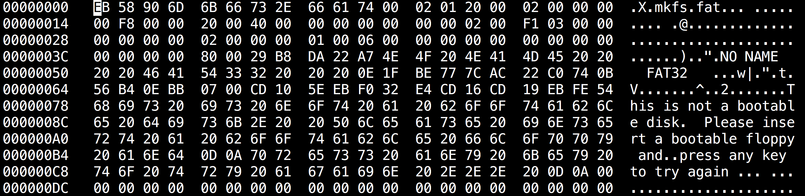

# Viewing with Hex Editor {#viewing-with-hex-editor}

In order to analyze the file system, we have to view it using hexadecimal editor.

There are two common hex editors in Ubuntu:

* hexedit
* xxd

Now try to view the disk file by hexedit. If you haven't unmount it, do it now.

In the terminal,

```
$ hexedit test.disk

```



There are three columns in the output:

1. Line number in hexadecimal
2. Content in Hexadeciaml
3. Content in ASCII

For one hex digit, 4 bits \(2^4 = 16\) are needed to represent 0-15\(0-F\). Two hex digits occipies 8bits = 1 byte, therefore they are in group of two.

